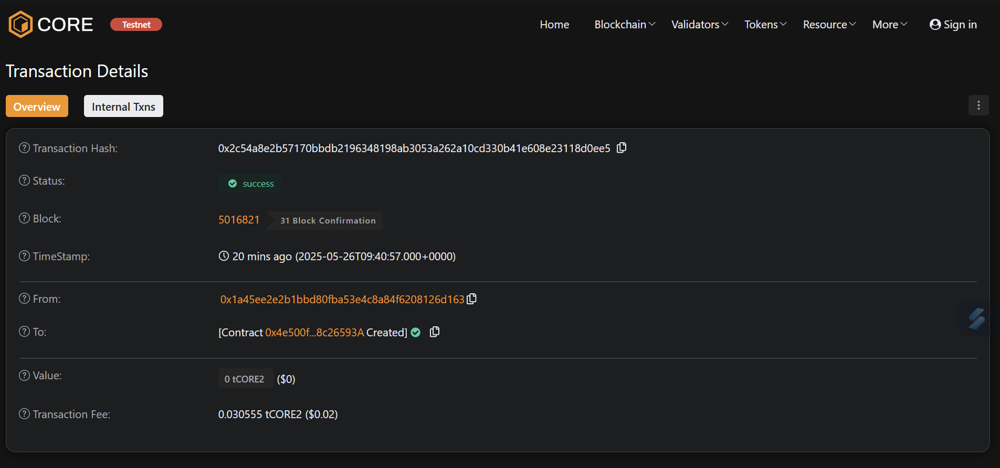

# B2B Supply Chain Smart Contract

---

## Contract Address

**Deployed on:**  
`0x4e500f43b8835c791de1e98deb4835618c26593a`

*Replace with your deployed contract address*

---

## Description

This smart contract allows businesses to register products, transfer ownership, and track the status of items through the supply chain using blockchain technology.

---

## Features

- Register new products  
- Transfer ownership  
- Track product status (Manufactured, In Transit, Delivered, Rejected)  
- View transfer history  
- Pause and unpause contract operations  

---

## How to Use

1. Replace the contract address above with your deployed contract address.  
2. Replace the image path with your project banner or logo.  
3. Compile and deploy the smart contract using your preferred tool (Remix, Hardhat, etc.)  
4. Interact with the contract using its functions.

---

